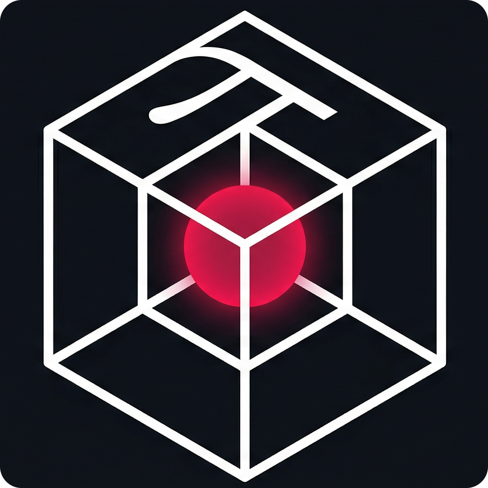

<a name="readme-top"></a>

<br />
<div align="center">
  <a href="https://github.com/Neoikiru/HUD">
    
  </a>

<h3 align="center">Project HUD</h3>

  <p align="center">
    A fully custom, wearable Augmented Reality operating system running bare-metal on a Raspberry Pi 5.
    <br />
    <br />
    <a href="https://github.com/Neoikiru/HUD/issues">Report Bug</a>
    ·
    <a href="https://github.com/Neoikiru/HUD/issues">Request Feature</a>
  </p>
</div>

<div align="center">
  
  
  
</div>

---

## About The Project

*Project HUD* is a highly optimized, multi-threaded Augmented Reality operating system built entirely from scratch.
Rather than relying on commercial VR headsets or tethered compute, this project proves that a standalone Raspberry Pi 5
can drive a real-time spatial computing environment.

It features zero-latency IMU head tracking, AI-driven bare-hand gesture recognition, a custom 3D UI rendering pipeline,
and direct integration with local smart home APIs.

<p align="right">(<a href="#readme-top">back to top</a>)</p>

---

## Hardware Architecture

This OS is designed for a custom wearable hardware payload:

* **Compute:** Raspberry Pi 5 (Active Cooling).
* **Perception Camera:** Sony IMX296 Global Shutter Camera (crucial for blur-free hand tracking in motion).
* **Spatial Tracking:** BNO08x IMU utilizing the internal Hillcrest SH-2 sensor fusion engine (Game Rotation Vector).
* **Display:** 240x240 LCD with custom optics.
* **Input:** Physical GPIO action button + 3D bare-hand tracking.

<p align="right">(<a href="#readme-top">back to top</a>)</p>

---

## Software Stack & Core Technologies

* **Graphics Pipeline:** OpenGL ES 3.1 & SDL3 for low-overhead rendering and window management.
* **Spatial UI:** Dear ImGui mapped dynamically to an off-screen Master Atlas texture.
* **AI & Computer Vision:** NCNN (Tencent's high-performance neural network inference framework) combined with OpenCV
  for hand landmark detection.
* **Mathematics:** GLM for rigid body transformations, quaternions, and ray-plane intersections.

<p align="right">(<a href="#readme-top">back to top</a>)</p>

---

## System Architecture

To achieve high framerates on mobile hardware, the engine strictly divides tasks across the Raspberry Pi's physical CPU
cores using a thread-pinned architecture, communicating via a thread-safe `SharedState` mutex block.

```mermaid
graph TD
    subgraph Hardware Layer
        IMU_HW[BNO08x Coprocessor] -.->|I2C 400kHz| IMU_DRV
        CAM_HW[IMX296 Camera] -.->|MIPI CSI| CAM_DRV
        BTN_HW[Physical Button] -.->|GPIO 17| INP_BTN
    end

    subgraph Core 1: Perception Thread
        CAM_DRV[Camera Driver] -->|Raw Frame Queue| MUTEX_CAM((Camera Mutex))
        IMU_DRV[BNO08x Driver] -->|SH - 2 Rotation Quat| MUTEX_IMU((IMU Mutex))
    end

subgraph Core 2: AI Inference Thread
MUTEX_CAM -->|cv::Mat|NCNN[NCNN Framework]
NCNN -->|Raw 2D Landmarks|EURO[1€ Temporal Filter]
EURO -->|Smoothed 2D| DEPTH[Metric Depth Projection]
MUTEX_IMU -->|Head Quat|DEPTH

DEPTH -->|Anatomical Pinch|MUTEX_HAND((Hand Mutex))
DEPTH -->|World Space 3D|MUTEX_HAND
end

subgraph Core 3: SLAM Thread 'WIP'
MUTEX_CAM -.->|Grayscale Frames|VIO[Visual-Inertial Odometry]
MUTEX_IMU -.->|High - Freq Accel/Gyro|VIO
VIO -.->|6DOF World Pose|MUTEX_SLAM((SLAM Mutex))
MUTEX_SLAM -.->|World Position|DEPTH
end

subgraph Core 0: Main Engine Thread
MUTEX_IMU -->|Head Quat|AR_CAM[ArCamera]
MUTEX_SLAM -.->|World Position|AR_CAM
AR_CAM -->|HUD / World MVP Matrices| GL[OpenGL ES 3.1 Pipeline]

MUTEX_HAND -->|Eye - to - Finger Ray|INP_BRIDGE[Interaction Bridge]
INP_BTN[GPIO Poller] -->|Tap / Double Tap|INP_BRIDGE

INP_BRIDGE -->|Fake Mouse/Click Inject|IMGUI[Dear ImGui Context]
IMGUI -->|2D Draw Data|ATLAS[SpatialUIManager]
ATLAS -->|Render FBO|TEX[(Master Atlas Texture)]

TEX -->|Bind Texture|GL
GL -->|Draw 3D Spatial Panels|DISP[240x240 Custom Optics]
end
````

<p align="right">(<a href="#readme-top">back to top</a>)</p>

-----

## Spatial Interaction Paradigm

### 1. The Master Atlas FBO

Traditional UI engines (like ImGui) are not built for 3D space. Instead of forcing the engine to render UI directly to
the screen, Project HUD allocates a massive, invisible `2048x2048` Framebuffer Object (FBO).

1. The `SpatialUIManager` packs all 2D windows onto this invisible texture.
2. The 3D Engine spawns physical Quads in the room.
3. Custom shaders dynamically crop the exact UV coordinates of the Atlas to project specific widgets onto the floating
   glass panels.

### 2. Head-to-Finger Raycasting

Instead of calculating pointing vectors from the wrist (which causes massive jitter over distance), the
`InteractionBridge` uses a **Head-to-Finger** aiming model.
The system draws a mathematical raycast from physical Eye (Camera Origin) directly through Index Finger Tip, projecting
a stable cursor onto the 3D planes in the room.

### 3. Anatomical Pinch Detection

Clicks are registered with almost zero latency. The NCNN hand tracker continuously monitors the 2D pixel distance
between the thumb and index finger landmarks. When the distance crosses a tuned threshold, the engine injects a
hardware-level `MouseDown` event directly into the ImGui context.

<p align="right">(<a href="#readme-top">back to top</a>)</p>

-----

## Smart Home Integration

The spatial UI directly manipulates the physical environment by wrapping `curl` system calls in detached background
threads, pinching a floating button instantly triggers local Home Assistant API endpoints without stalling the main
engine's render loop.

*Example Use Case:* Pinching the "Desk Lamp" panel in AR physically turns on the desk lamp via a smart plug.

<p align="right">(<a href="#readme-top">back to top</a>)</p>

-----

## Roadmap

- [x] Bare-metal OpenGL ES integration on Pi 5.
- [x] BNO08x hardware initialization & sensor fusion.
- [x] NCNN AI Hand Tracking with temporal filtering.
- [x] Spatial OS Master Atlas UI architecture.
- [x] Head-to-Finger Raycast Interaction Bridge.
- [x] Home Assistant API integration.
- [ ] Implement full 6DOF SLAM tracking.
- [ ] Enable physical dragging and resizing of 3D panels.

<p align="right">(<a href="#readme-top">back to top</a>)</p>

-----

## License

Distributed under the MIT License. See [License](LICENSE.txt) for more information.

*Note: This project relies on several fantastic open-source libraries. Those specific components remain under their
respective original licenses (MIT, zlib, BSD, etc.).*

<p align="right">(<a href="#readme-top">back to top</a>)</p>

-----

## Acknowledgments

This project was built by standing on the shoulders of some incredible open-source projects:

* [Dear ImGui (ocornut)](https://github.com/ocornut/imgui) - For the bloat-free immediate mode GUI paradigm that makes
  this spatial atlas possible.
* [SDL3 (libsdl-org)](https://github.com/libsdl-org/SDL) - For rock-solid window, OpenGL context, and thread management.
* [NCNN (Tencent)](https://github.com/Tencent/ncnn) - For the blazing-fast, mobile-optimized neural network inference
  framework.
* [NCNN Hand Tracking Models (FeiGeChuanShu)](https://github.com/FeiGeChuanShu/ncnn-Android-mediapipe_hand) - For
  porting Google's MediaPipe models to NCNN, making bare-metal mobile inference a reality.
* [1€ Filter (casiez)](https://github.com/casiez/OneEuroFilter) - For the elegant 1 Euro Filter algorithm that cleanly
  eliminates high-frequency neural network jitter while preserving zero-latency high-speed hand movements.
* [Adafruit BNO08x Python Library](https://github.com/adafruit/Adafruit_BNO08x) - For the reference implementation that
  was invaluable for reverse-engineering the SH-2 coprocessor state machine to build our custom C++ hardware driver.
* [GLM (g-truc)](https://github.com/g-truc/glm) - For keeping the quaternion and matrix math sane.
* [libcamera & Raspberry Pi ISP](https://libcamera.org/) - For the modern camera stack that allows zero-copy frame
  polling from the IMX296 sensor.
* [Glad](https://glad.dav1d.de/) - For handling OpenGL ES 3.1 extension loading.
* [OpenCV](https://opencv.org/) - For camera matrix projections and image buffer handling.
* [Home Assistant](https://www.home-assistant.io/) - For providing the ultimate local smart-home API.

<p align="right">(<a href="#readme-top">back to top</a>)</p>